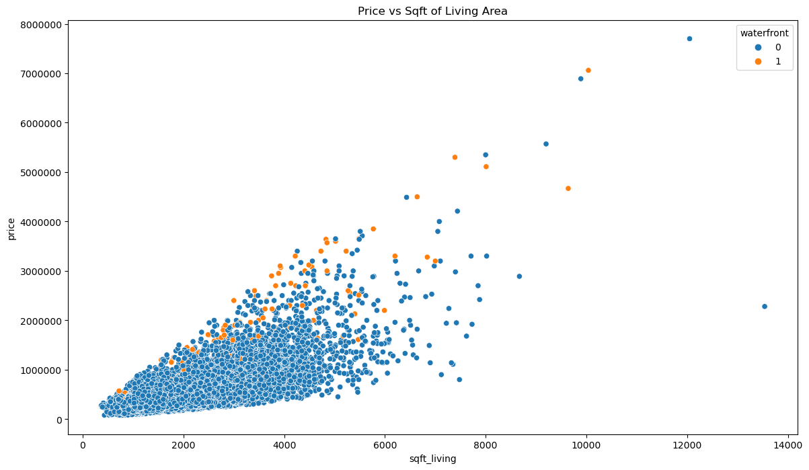
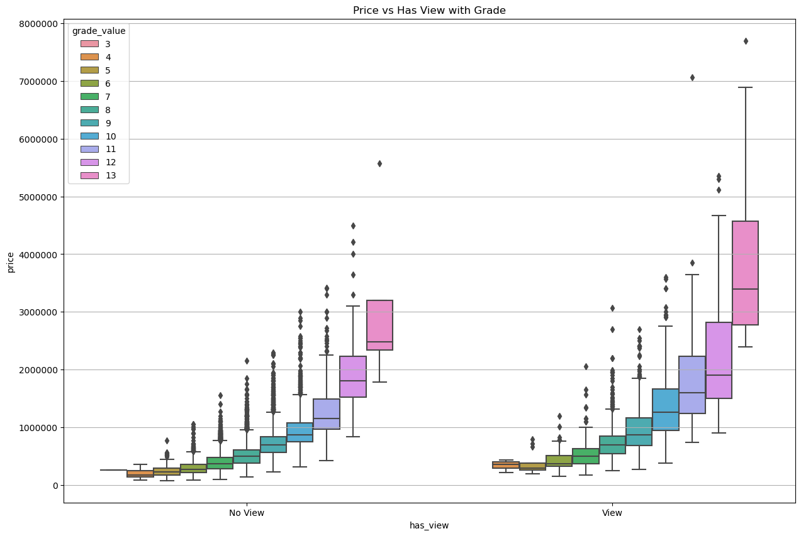
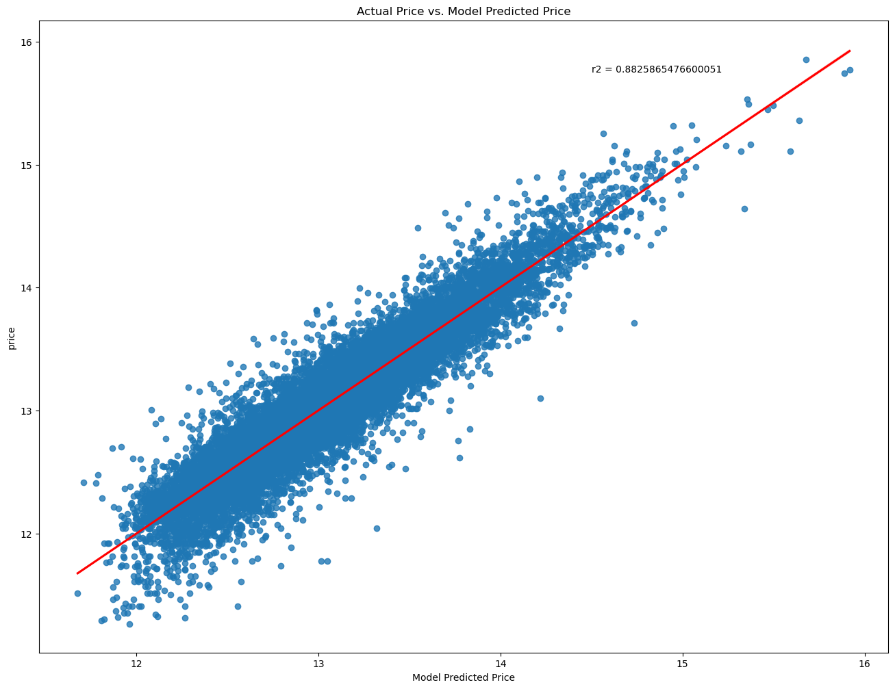

# King County Housing

# **Author**: Josh Palgon

## Overview

Hugh Honey and Vic Vinegar have decided to expand Honey and Vinegar Real Estate into King County. I have been tasked with helping Hugh and Vic navagate the King County market and maximize profits. In order to maximize profits I am going to look at which features impact the price of a King County home the most. The data source provided is from Kaggle and contains King County housing data from May 2014 until May 2015.

The two main issues for cleaning the data set was converting all the object data types into a numeric data type and imputing or removing missing data. My goal was to remove as little data as possible and carefully imputing data in the most accurate way.

Sqft_living had the highest correlation with price. Waterfront: $608,976, grade_value: $99,787 and view: $68,547 were three of the highest coefficients in my baseline model. After running my model, I compared the actual price vs my predicted price. I looked at the highest values of my predicted price subtracted by the actual price to find what actual prices may be undervalued. Waterfront, view, and the zipcodes: 98010, 98118, 98146, 98122, 98033 were the most undervalued. My recommendation for Honey and Vinegar real estate would be to focus on houses that maximize sqft_living, have high grade_values, and have a waterfront, view, or are in the 5 undervalued zipcodes.

## Business Problem

Hugh Honey and Vic Vinegar want to take their real estate prowess to King County. However, as Philadelphia residents they are not familiar with the area and would like guidance on how to conquer King County and maximize their profits for their newly founded western branch.

In order to maximize profits, Hugh and Vic need to sell as many houses as they can. Additionally, if they accurately provide their customers with homes that grow in value, they can build a reputation of making their customers happy in both the short and long term. This will help drive more customers to choose Honey and Vinegar Real Estate.

## Data

The Kaggle dataset provided was the King County Housing Data (`kc_house_data.csv`) from May 2014 until May 2015.

Cleaning the data came with two main tasks: converting all of the object data types to a numeric data type and imputing or removing missing data. All but one feature were converted to a binary or ordinal scale and some were converted both ways (ex view) to see if the binary or ordinal scale of having a view mattered more.

In order to imputing the missing data in the best possible way I dug into each of the columns to determine the best course of action. For some features, I took the most common value (yr_renovated), for others I used a scale of a correlated ordinal or binary scaled feature to best impute the missing values, and another I was able to replace the entire column of values by making a calculation from two other features (sqft_living - sqft_above = sqft_basement).

In the end I only had to remove one outlier row where bedrooms was equal to 33. Other than that single row I was able to impute for all missing values and keep all existing rows.

## Methods and Modeling

My first step in understanding was to look at features that had the highest correlation with price. Sqft_living was the top feature followed by grade_value and sqft_living15 (the sqft of living for the nearest 15 neighbors). 

My next step was to run my first linear regression model. I wanted to establish a good baseline model to pull out coefficients. Waterfront ($608,976), Grade ($99,787), View ($68,547) were among my top coefficients after running my baseline model.

I wanted to start my model as simple as possible so I just ran a linear regression on price using sqft_living (R2 = 0.49). Over 4 steps, I added some of the most important features to get an R2 = 0.70.

In my next modeling step I took the log of price and again started with just price (this time logged) using sqft_living (R2 = 0.45). While it started off lower than my first block of models after adding more important features I got an R2 = 0.77.

Next, I One Hot Encoded zipcode. With just sqft_living and zipcode One Hot Encoded my R2 = 0.72. Without any log transformations I added some of the most important features to this block and got my baseline R2 = 0.80.

I kept doing this same method on different combinations of standard price, transformed price, standard sqfts', transformed sqfts', One Hot Encoded zipcode and no One Hot Encoded zipcodes.

My best and final model using logged price, transformed sqfts' and One Hot Encoded zipcode got an R2 = 0.88.

My final step was take the predictions of my final model and compare it to the actual prices. I wanted to look at the area where my model projected a higher price than the actual price to see what in the market might be undervalued. I found waterfront, view, and the zipcodes: 98010, 98118, 98146, 98122, 98033 to be my most undervalued features. 

## Results

### Price vs. Sqft_living

Animation, mystery and sci-fi are the top performing genres from 2010-2019.

### Price vs. Has a View

However animation has not been trending well, while mystery and sci-fi are still performing strong at the end of the timeframe. 

Horror and thriller are trending upward despite not being top 5. 

### Model Results

David Lowery is the top performing director and writer, despite being in the fantasy genre, which is not top 5.

## Conclusions

Microsoft should invest in mystery and sci-fi movies due to their high median ROI and recent upward trend. Although animation has been doing well, it appears to be on a downward trend, so we do not recommend that Microsoft invests in this genre at the point.

Horror and thriller movies should be monitored due to their recent growth, if they continue to show growth, Microsoft should consider investing in these genres.

David Lowery is the highest performing director and writer, so Microsoft should consider making a fantasy movie spearheaded by David Lowery.

For the future, we would like to gather more data to fill in some of the gaps in our data set. Our data has many different naming conventions that made merging difficult, and it would be prudent to look into the `FuzzyWuzzy` Python package to utilize fuzzy logic to increase title match rates. We would also like to get the most recent years of data as our data only contained entries up to 2019.

Other variables we would investigate include parental guideline ratings and user ratings. One of our data sources had parental guidelines but no titles, making it impossible to merge to our overall dataset. Parental guidelines may determine overall viewership population, while user ratings could help determine the popularity of a genre and the current trend of which genres hold the most public favor.

## For More Information

Please look at our full analysis in [our Jupyter Notebooks](./notebooks) or our [presentation](./Movie_Presentation.pdf).

For any additional questions, please contact:

<ul>
    <li>Josh Palgon (jopalgon@gmail.com)</li>
